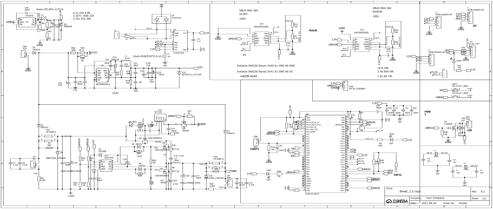

# RT-Thread MPPT Power Node Hardware

本仓库整理“基于 Linux + RT-Thread AMP 混合架构的户外光伏自供能智能监测终端”中的 PCB-02 光伏 MPPT 功率控制节点硬件资料，包含原理图 PDF、Gerber/钻孔生产文件和开源发布说明。

## 项目简介

在实际科研、工程项目中，野外边坡、基坑、挡墙、塔架等场景的无人值守监测面临基站建设成本高，传感器布设困难、协议异构、拓扑复杂、数据量大、能源供给不稳定等痛点，难以满足临时监测、应急排查或短期科研观测的灵活需求。本项目设计一种基于 Linux + RT-Thread AMP 混合架构的光伏自供能智能监测终端：RT-Thread 作为实时控制层，负责传感器采集、电源状态监测、异常触发与电源控制等硬实时任务；Linux 作为智能服务层，负责数据存储、无线通信、边缘计算、图形交互、网关转发及本地模型推理等非实时任务，双系统通过 rpmsg 实现高速核间通信。能源侧融合 MPPT、高效 DC-DC 变换及逆变器控制技术，构建稳定自供能平台；网络侧支持多节点数据汇聚、协议转换、本地缓存与远程转发，形成完整的边缘网关能力。

相比传统方案，本项目支持快速布设、随用随迁。以 AMP 双系统协同为核心，将光伏电源精细化控制、边缘智能网关与野外便携部署有机统一，在功能性、可用性与便携性之间取得平衡。依托 RT-Thread 工业开发平台，进一步探索本地轻量化模型在异常识别、事件摘要与人机交互中的边缘部署价值，响应大赛以及赛题号召。

## 仓库目录

```text
.
├── README.md
├── LICENSE
├── LICENSE_OPTIONS.md
├── docs/
│   ├── DESIGN_NOTES.md
│   ├── HARDWARE_OVERVIEW.md
│   ├── INTERFACES.md
│   ├── OPEN_SOURCE_CHECKLIST.md
│   ├── REPOSITORY_SETUP.md
│   ├── images/
│   │   └── MPPT-schematic-1.png
│   └── release-notes/
│       └── v0.1.0.md
└── hardware/
    ├── fabrication/
    │   └── MPPT-gerber-drill-fabrication.zip
    ├── gerber/
    │   └── extracted/
    └── schematic/
        └── MPPT-schematic.pdf
```

## 关键文件

| 文件 | 说明 |
| --- | --- |
| `hardware/schematic/MPPT-schematic.pdf` | MPPT 功率控制节点原理图 PDF |
| `hardware/fabrication/MPPT-gerber-drill-fabrication.zip` | Gerber/钻孔生产文件原始压缩包 |
| `hardware/gerber/extracted/` | 已解压的 Gerber、钻孔和飞针测试文件 |
| `docs/HARDWARE_OVERVIEW.md` | 硬件功能概览 |
| `docs/INTERFACES.md` | 接口和信号说明 |
| `docs/DESIGN_NOTES.md` | 设计定位与发布边界 |

## 原理图预览



如果预览图中文字或符号显示异常，请以 `hardware/schematic/MPPT-schematic.pdf` 为准。

## 安全说明

该硬件涉及光伏输入、电池充电、大电流 DC-DC 和锂电/铅酸电池系统。打样和上电前必须配合限流电源、保险丝、BMS、电子负载、隔离调试和必要的硬件过压/过流/过温保护。软件保护不能替代硬件保护。

## 开源许可证

本仓库采用 `CERN-OHL-P-2.0` 许可证发布硬件资料。
